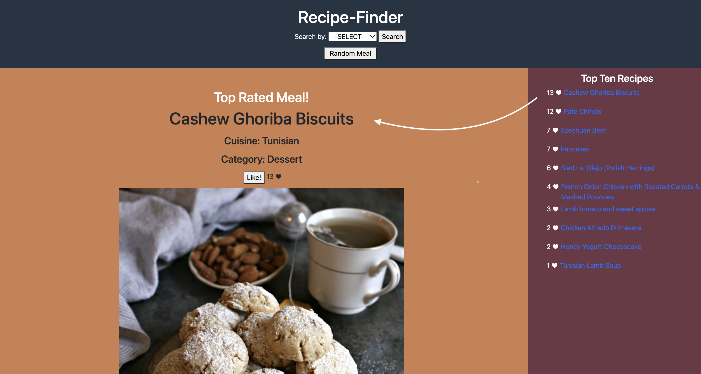

# Recipe-Finder

Recipe Finder is a web application that allows the user to search and filter through a database of meal recipes. 

## Badges

## Features

- Meal Images
- Ingredients List
- Step by step instructions
- User Comments and Likes

## Description
On initial startup, Recipe Finder loads the top user rated meal to the center show panel.  In the right panel, the app loads the top ten rated meals.

The Header offers a Random Meal button that when clicked generates a random meal and displays it to the center show panel.

The header also offers a recipe search option via the 'search by:' drop down menu.  Then, depending on the selected option, either a text input or a secondary dropdown menu will appear.    

Once the search button is clicked, the results populate in the left results panel.  Here the user can select a meal which will then be displayed in the center show panel.  The show panel displays the the meal name, image, ingredient list, and step by step instructions.  It also give the user the option to like the recipe and leave a comment.

